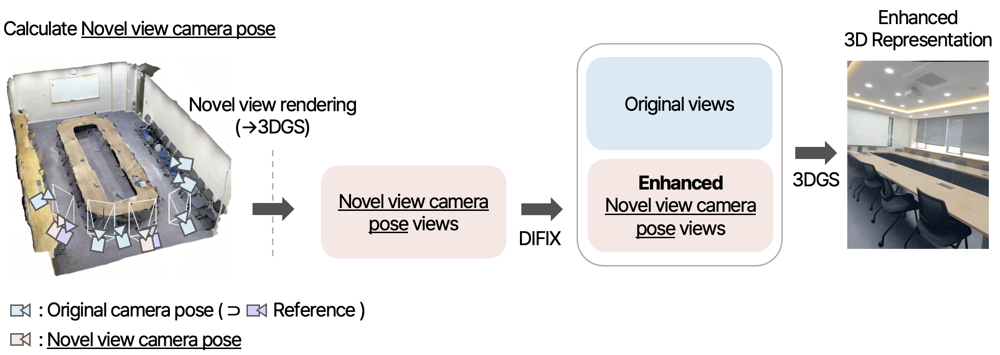
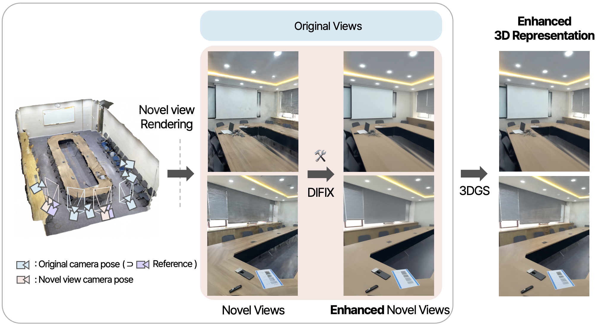

## Project Goal

- Enhance the quality of 3D reconstruction  
- Improve multi-view consistency  
- Incorporate geometry-aware loss terms for accurate surface reconstruction  

## Project Page

----------

    <iframe src="https://chehun16.github.io/gs-quality/" width="800" height="400" 
            style="display: block; margin: auto; border: none;"></iframe>

    Detailed information about the project can be found in the 
    <a href="https://chehun16.github.io/gs-quality/" target="_blank" style="color: gray; text-decoration: underline;">
        project page
    </a> above!

<ul>
  <li><a href="https://chehun16.github.io/gs-quality/" target="_blank">Project page</a></li>
  <li><a href="https://lacy-tick-ae2.notion.site/Novel-View-Pose-Synthesis-with-Geometry-Aware-Regularization-for-Enhanced-3D-Gaussian-Splatting-245b0c1a844f80e096fbd720f5484f0d" target="_blank">Project detail</a></li>
</ul>

---------------

 

## Project Overview

  

⬇️

  

I developed a method to enhance indoor 3D reconstruction with **3D Gaussian Splatting (3DGS)** by generating  
novel view camera poses, refining them with **DIFIX**, and applying **geometry-aware loss terms**.  
This approach improves geometry accuracy, multi-view consistency, and reduces artifacts.

---

## Contributions

1. **Novel view camera pose generation**
   - Expanded spatial coverage and ensured consistency between viewpoints  
   - Removed artifacts in novel-view renderings using **DIFIX**

2. **Introduction of additional loss terms**
   - Applied **LPIPS loss** only to novel views to preserve structural details beyond pixel similarity  
   - Applied **normal consistency loss** and **depth smoothness loss** to all views to improve geometry quality  

---

## Results

| Method            | Initial Points | PSNR ↑ | SSIM ↑ | Training Time | Frames |
|-------------------|----------------|--------|--------|---------------|--------|
| 3DGS              | 100,000        | 20.423 | 0.856  | 2h 13m        | 168    |
| 2DGS              | 100,000        | 19.219 | 0.828  | 2h 1m         | 168    |
| 2DGS (Novel)      | 100,000        | 20.375 | 0.842  | 1h 59m        | 208    |
| **Ours (Novel)**  | 100,000        | **21.605** | **0.861** | 2h 6m | 208 |
| **Ours + Loss**   | 100,000        | **21.675** | **0.862** | 3h 55m | 208 |

- Compared to **3DGS**, our method improves **PSNR from 20.423 → 21.675** and **SSIM from 0.856 → 0.862**  
- Applying the method to **2DGS** also yields consistent improvements, demonstrating generalizability  

---

## Results

  <video width="320" controls>
    <source src="assets/video/cg1.mp4" type="video/mp4">
  </video>
  <video width="320" controls>
    <source src="assets/video/cg2.mp4" type="video/mp4">
  </video>

 

    <strong>🧑‍💻 My Role:</strong> Conceived the research idea, designed the methodology, and carried out the entire implementation 
    — including dataset preparation, novel view generation, loss function integration, and experimental evaluation — with advisory 
    input from a doctoral researcher.

 
 
 

<a href="https://github.com/chehun16/3dgs-quality" style="text-decoration: none; display: inline-flex; align-items: center; padding: 6px 10px; background-color: #333; color: white; border-radius: 5px; font-size: 14px; font-weight: bold;">
    
    3dgs-quality-enhancement
</a>